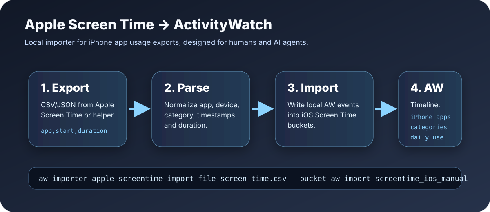

# aw-importer-apple-screentime



Local **Apple iPhone Screen Time → ActivityWatch** importer. It parses local CSV/JSON exports and writes app-usage events into ActivityWatch.

This is meant to complement device-side ActivityWatch data and health imports such as WHOOP. It keeps Apple Screen Time data local and makes iPhone usage visible in the same ActivityWatch timeline as desktop activity.

## Current scope

- ✅ CSV import
- ✅ JSON import
- ✅ ActivityWatch bucket creation
- ✅ Dry-run preview
- ✅ Tests + GitHub Actions CI
- ✅ Designed for humans and AI agents

## Why this exists

Apple Screen Time is useful but isolated. ActivityWatch is useful because it creates a local timeline. This importer bridges both:

- iPhone usage becomes ActivityWatch events
- app names/categories can be analyzed next to Mac usage
- agents can reason about focus, context switching, and phone distraction locally

## Data model

Default bucket:

```text
aw-import-screentime_ios_manual
```

Event type:

```text
app
```

Event data:

```json
{
  "app": "Signal",
  "device": "iPhone",
  "category": "Social",
  "source": "apple_screentime_export",
  "event_hash": "..."
}
```

## Input CSV format

Required:

- `app` or `application` or `name` or `display_name` or `bundle_id`
- `start` or `start_time` or `timestamp` or `date`
- either `duration_seconds` / `duration` / `seconds` / `total_seconds` or `end` / `end_time`

Optional:

- `device`
- `category`

Example:

```csv
app,start,duration_seconds,device,category
Signal,2026-05-09T10:00:00+00:00,120,iPhone,Social
Safari,2026-05-09T10:05:00+00:00,300,iPhone,Productivity
```

Duration can also be human-readable:

```text
45 min
1 h 30 min
```

## Input JSON format

```json
{
  "events": [
    {
      "app": "Signal",
      "start": "2026-05-09T10:00:00+00:00",
      "duration_seconds": 120,
      "device": "iPhone",
      "category": "Social"
    }
  ]
}
```

A top-level JSON array also works.

JSON accepted fields are narrower than CSV: app name can be `app`, `name`, or `bundle_id`; start time can be `start`, `timestamp`, or `date`; duration can be `duration_seconds`, `duration`, or `seconds`. JSON does not currently support `end`/`end_time`.

Use timezone-qualified timestamps where possible. Naive timestamps are interpreted as UTC. CSV rows without app or start are skipped; malformed duration/end values raise errors. JSON rows are stricter and missing required fields raise errors.

## Install

```bash
git clone https://github.com/Martin-Hausleitner/aw-importer-apple-screentime.git
cd aw-importer-apple-screentime
python3 -m venv .venv
. .venv/bin/activate
pip install -e . pytest ruff
pytest -q
```

## Verify ActivityWatch

ActivityWatch should be running locally:

```bash
curl http://127.0.0.1:5600/api/0/info
```

## Dry run

```bash
aw-importer-apple-screentime import-file screen-time.csv --dry-run
```

## Import into ActivityWatch

```bash
aw-importer-apple-screentime import-file screen-time.csv \
  --bucket aw-import-screentime_ios_manual
```

## Existing ActivityWatch Screen Time buckets

If you already have buckets like this, the importer is compatible with the same naming idea:

```text
aw-import-screentime_ios_<device-id>
```

You can choose your target bucket explicitly:

```bash
aw-importer-apple-screentime import-file screen-time.csv \
  --bucket aw-import-screentime_ios_MY-IPHONE
```

## For AI agents

Start with the repo-local agent docs:

```text
AGENTS.md
skills/aw-importer-apple-screentime/SKILL.md
```

The skill is the canonical runbook for dry-runs, ActivityWatch imports, bucket verification, privacy handling, and repository maintenance.

Safe workflow:

- Never read private Screen Time source files aloud unless asked.
- Parse with `--dry-run` first.
- Report only totals, top apps, and bucket ids by default.
- Dry-run output includes up to 10 raw app/device preview rows; do not paste it into chats, issues, logs, or commits unless the user explicitly approves.
- Do not commit exports; keep them in `exports/` or outside the repo.
- Verify ActivityWatch buckets and sample imported events after import.

Agent checklist:

```bash
curl -fsS http://127.0.0.1:5600/api/0/info
aw-importer-apple-screentime import-file exports/screen-time.csv --dry-run
aw-importer-apple-screentime import-file exports/screen-time.csv --bucket aw-import-screentime_ios_manual
```

Then check buckets:

```bash
python3 - <<'PY'
import json, urllib.request
buckets = json.load(urllib.request.urlopen('http://127.0.0.1:5600/api/0/buckets/'))
for bucket_id, meta in sorted(buckets.items()):
    if bucket_id.startswith('aw-import-screentime'):
        print(bucket_id, meta.get('type'), meta.get('created'))
PY
```

After import, fetch events from the target bucket for the imported date range and verify the count is plausible, timestamps match the dry-run range, durations are positive, and event data includes `app`, `device`, `source=apple_screentime_export`, and `event_hash`.

## For normal humans

1. Export or prepare a CSV/JSON with app, start time, and duration.
2. Start ActivityWatch.
3. Run dry-run.
4. Import.
5. Open ActivityWatch and inspect the new iPhone Screen Time bucket.

## Idempotency

The CLI adds a stable `event_hash` to every imported event, but it does not deduplicate before inserting. Re-running the same overlapping file posts duplicate ActivityWatch events. Use a wrapper or manual verification before re-importing overlapping files; the stack-level hourly wrapper tracks imported files by SHA-256 so unchanged exports are not imported repeatedly. If a vendor export is edited and contains overlapping rows, prefer re-exporting to a new file and reviewing with `--dry-run` first.

## Privacy

- No cloud service is required by this importer.
- No Apple ID credentials are needed.
- The importer only reads files you provide.
- Exports can contain sensitive app usage patterns; do not commit them.

## Relationship to WHOOP importer

The recommended health/focus model is:

- WHOOP sleep/workouts as real timeline blocks
- WHOOP recovery/day strain as daily metrics
- iPhone Screen Time as app-usage timeline blocks
- ActivityWatch desktop usage as the baseline work timeline

Together, these make a useful local picture of work, sleep, training, recovery, and phone distraction.

## Development

```bash
pytest -q
ruff check .
```

## License

MIT
